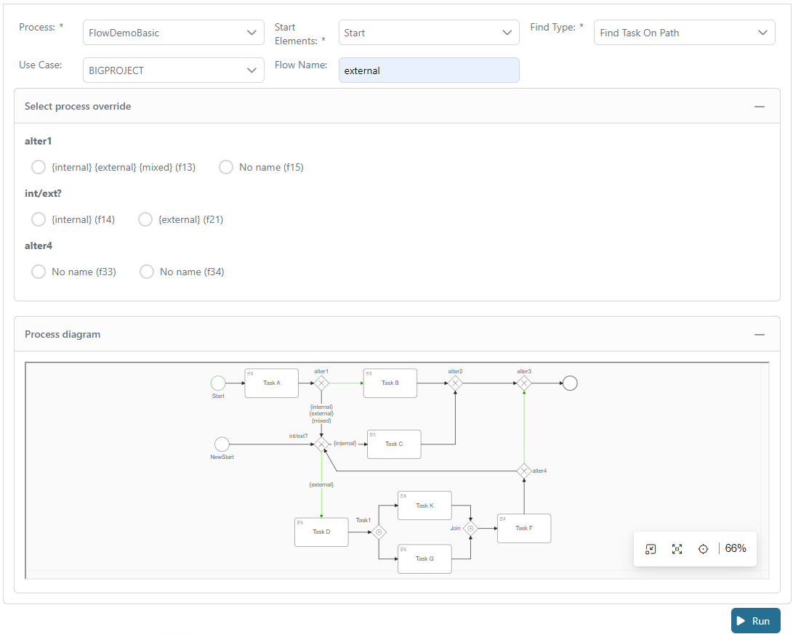
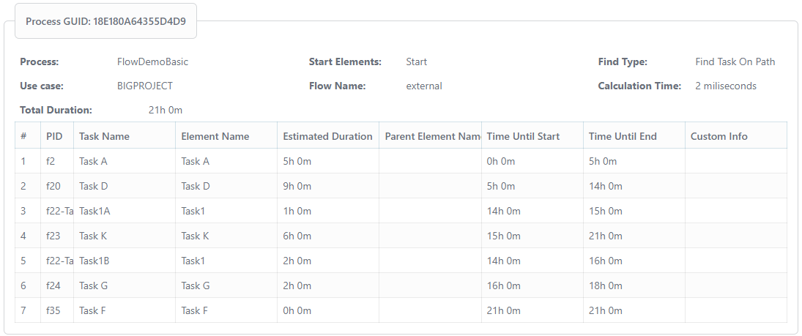

# Advanced Process Analyzer

Axon Ivy’s [Advanced Process Analyzer] helps you to:

- Configure needed information directly in the process model
	- Default duration of a task for multiple use cases. Each task can have multiple named default durations.
	- Different “happy path” flows. It’s possible to set multiple named process paths.
- Possibilities to override settings of the process model
	- Override duration
	- Override default path for the gateways
- Create a list of all tasks in the process.
- Get configured duration for a task.
- Get all upcoming tasks on a configured process path with expected start timestamp for each task.

## Demo

- Select the process and some configuration which need for your analysis

- Hit the **Run** button to get the analysis result



## Setup

In the project, you only add the dependency in your pom.xml and call public APIs

**1. Add dependency**
```XML
	<dependency>
		<groupId>com.axonivy.utils.process.analyzer</groupId>
		<artifactId>process-analyzer</artifactId>
		<version>${process.analyzer.version}</version>
	</dependency>
```
**2. Call the constructor to set some basic information.  Each instance of the advanced process analyzer should care about one specific process model. This way we can store some private information (e.g. simplified model) in the instance and reuse it for different calculations on this object.**
```java
	/** 
	 * @param process - The process that should be analyzed.
	 * @param useCase - Use case that should be used to read duration values.
	 * If it is null, it will get first duration configure line
	 * @param flowName - Tag name we want to follow at alternative gateways.
	 */
	public AdvancedProcessAnalyzer(Process process, UseCase useCase, String flowName)
```
**3. You can custom the process flow or task duration**
```java
	/**
	 * This method can be used to override configured path taken after an alternative gateway.
	 * @param processFlowOverrides
	 * key: element ID + task identifier (for support of callable sub-processes, we also need to add the path of parent elements. However, not needed in first versions.)
	 * value: chosen output PID
	 * @return
	 */
	public AdvancedProcessAnalyzer setProcessFlowOverrides(HashMap<String, String> processFlowOverrides)
	
	/**
	 * This method can be used to override configured task duration of the model by own values.
	 * @param durationOverrides
	 * key: element ID + task identifier (for support of callable sub-processes, we also need to add the path of parent elements. However, not needed in first versions.)
	 * value: new duration
	 * @return
	 */
	public AdvancedProcessAnalyzer setDurationOverrides(HashMap<String, Duration> durationOverrides)
``` 
**4. You can call `findAllTasks`, `findTasksOnPath`, `calculateEstimatedDuration` to analyze your process.**
```java
	/**
	 * Return a list of all tasks in the process which can be reached from the starting element.
	 * @param startAtElement - Element where we start traversing the process
	 * @throws Exception
	 */
	public List<? extends DetectedElement> findAllTasks(BaseElement startAtElement) throws Exception

	/**
	 * Return a list of all tasks which are created when process follows the tagged flow. Uses the flow name set in the constructor.
	 * @param startAtElement - Element where we start traversing the process
	 * @throws Exception
	 */
	public List<? extends DetectedElement> findTasksOnPath(BaseElement startAtElement) throws Exception
	
	/**
	 * This method can be used to calculate expected duration from a starting point in a process until all task are done and end of process is reached.
	 * It will summarize duration of all tasks on the path. In case of parallel process flows, it will always use the critical path (which means path with longer duration).
	 * @param startElement - Element where we start traversing the process
	 * @throws Exception
	 */
	public Duration calculateEstimatedDuration(BaseElement startElement) throws Exception
```
