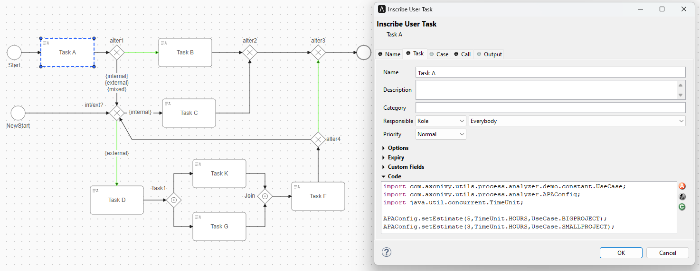
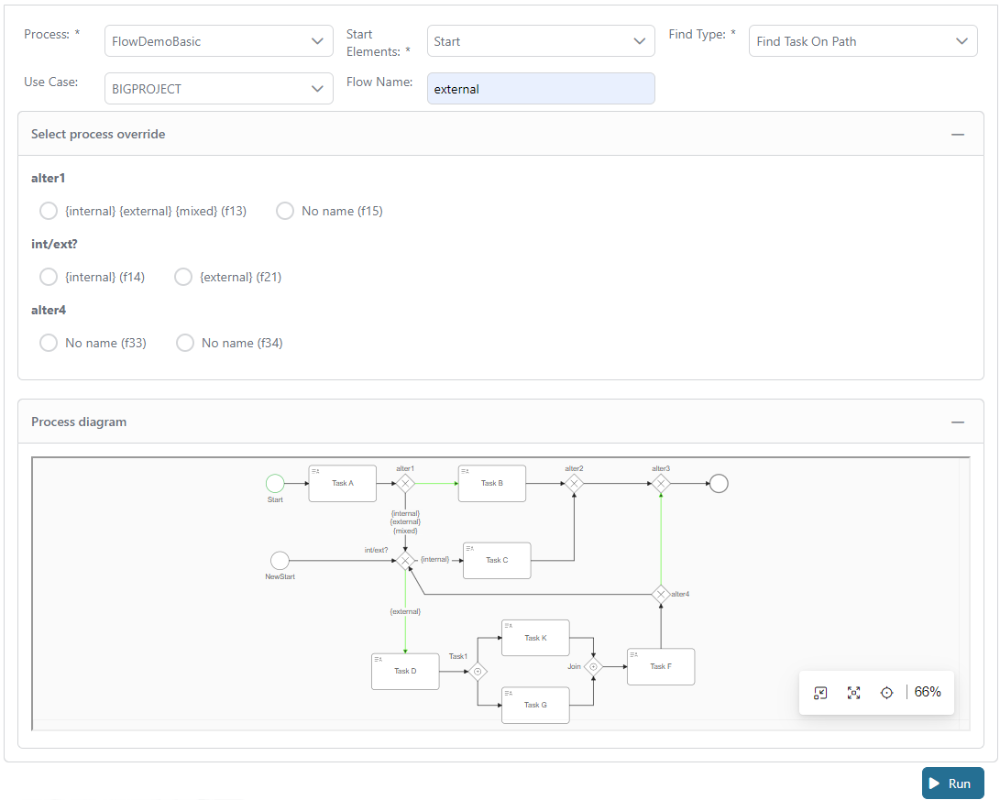
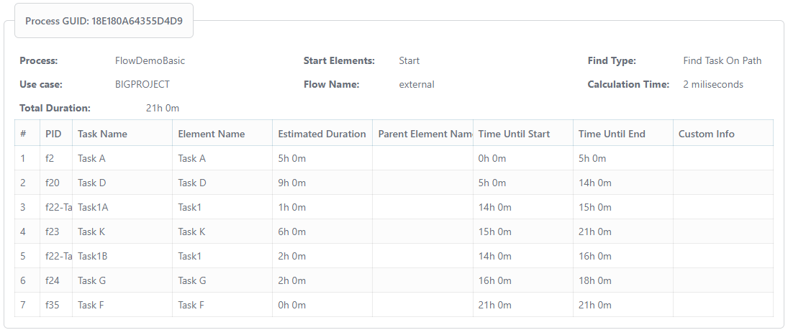

# Verarbeitet Inspektor

#Axon EfeusArbeitsgang Inspektor ist ein Tool jener erlaubt du zu prophezeien
den Abschluss von einem Fall. Die Vorhersage ist gegründet auf den
#voreingestellt #Dauer für Tasks verarbeitet herein #ein workflow. Dieser
Vorgabe Task #Dauer müssen sein konfiguriert manuell.

(1) Konfiguriert die #voreingestellt Dauer von die von den Tasks involvierten
direkt dabei modellieren.\
(2) Schafft eine Liste von alle Tasks dabei und ihr prophezeit Abschluss
datiert.

## Setup

In dem Projekt, du zufügen nur die Kolonie herein eure pom.xml Und rufen
öffentlich APIs

**1. Füg zu Kolonie**
```XML
<dependency>
		<groupId>com.axonivy.utils.process.inspector</groupId>
		<artifactId>process-inspector</artifactId>
		<version>${process.inspector.version}</version>
	</dependency>
```
**2. Ruf den Erbauer zu setzen einige einfache Auskunft. Jede Instanz von den
Arbeitsgang Inspektor sollte von eins spezifisches Arbeitsgang Model kümmern.
Hier können wir lagern einige persönliche Auskunft (#z.B. vereinfacht
modelliert) in der Instanz und #wiederbenutzen ihm für verschieden Berechnungen
auf diesem Objekt.**
```java
/** 
	 * @param process - The process that should be analyzed.	 
	 */
	public AdvancedProcessInspector(Process process)
```
**3. Du kannst #benutzerdefiniert die Arbeitsgang Strömung oder beschäftigen
Dauer**
```java
/**
	 * This method can be used to override configured path taken after an alternative gateway.
	 * @param processFlowOverrides
	 * key: element ID + task identifier (for support of callable sub-processes, we also need to add the path of parent elements. However, not needed in first versions.)
	 * value: chosen output PID
	 * @return
	 */
	public ProcessInspector setProcessFlowOverrides(HashMap<String, String> processFlowOverrides)

	/**
	 * This method can be used to override configured task duration of the model by own values.
	 * @param durationOverrides
	 * key: element ID + task identifier (for support of callable sub-processes, we also need to add the path of parent elements. However, not needed in first versions.)
	 * value: new duration
	 * @return
	 */
	public ProcessInspector setDurationOverrides(HashMap<String, Duration> durationOverrides)

	/**
	 * Disabled by default.
	 * If this option is enabled, the Process Inspector will also add all alternative elements to the result.
	 * This option will affect findTasksOnPath as well as findAllTasks method. Both methods will traverse the process as usual.
	 * When it bypasses an alternative element, it will be added to the result list.
	 */
	public void enableDescribeAlternativeElements()
	public void disableDescribeAlternativeElements()
```
**4. Du kannst rufen `findAllTasks`, `findTasksOnPath`,
`calculateWorstCaseDuration` `calculateDurationOfPath` zu analysieren euren
Arbeitsgang.**
```java
/**
	 * Return a list of all tasks in the process which can be reached from the starting element.
	 * @param startAtElement - Element where we start traversing the process
	 * @param useCase - Use case that should be used to read duration values. Durations will be set to 0 in case not provided.
	 * If it is null, it will get first duration configure line
	 * @param flowName - Tag name we want to follow at alternative gateways.
	 * @throws Exception
	 */
	public List<? extends DetectedElement> findAllTasks(BaseElement startAtElement, Enum<?> useCase) throws Exception

	/**
	 * Return a list of all tasks which are created when process follows the tagged flow. Uses the flow name set in the constructor.
	 * @param startAtElement - Element where we start traversing the process
	 * @param useCase - Use case that should be used to read duration values. Durations will be set to 0 in case not provided.
	 * If it is null, it will get first duration configure line
	 * @param flowName - Tag name we want to follow at alternative gateways.
	 * @throws Exception
	 */
	public List<? extends DetectedElement> findTasksOnPath(BaseElement startAtElement, Enum<?> useCase, String flowName) throws Exception

	/**
	 * This method can be used to calculate expected worst case duration from a starting point in a process until all task are done and end of process is reached.
	 * In case of parallel process flows, it will always use the “critical path” (which means path with longer duration).
	 * @param startElement - Element where we start traversing the process
	 * @param useCase - Use case that should be used to read duration values. Durations will be set to 0 in case not provided.
	 * If it is null, it will get first duration configure line
	 * @param flowName - Tag name we want to follow at alternative gateways.
	 * @throws Exception
	 */
	public Duration calculateWorstCaseDuration(BaseElement startElement, Enum<?> useCase) throws Exception

	/**
	 * This method can be used to calculate expected duration from a starting point
	 * using a named flow or default flow. For parallel segments of the process, it
	 * will still use the “critical path” (same logic like worst case duration).
	 * 
	 * @param startElement - Element where we start traversing the process
	 * @param useCase      - Use case that should be used to read duration values.
	 *                     Durations will be set to 0 in case not provided.
	 * @return
	 * @throws Exception
	 */
	 public Duration calculateDurationOfPath(BaseElement startElement, Enum<?> useCase, String flowName) throws Exception;
```

### Beispiel

- Jetzt wollen wir #einüben Wie den Arbeitsgang zu analysieren unten mit einigen
  Szenarios. 

**1. Wie zu analysieren das workflow gründen auf den Strömung Namen {extern} mit
benutzen Fall BIGPROJECT?**
```java
// We create a new process inspector with UseCase.BIGPROJECT and flowName is "external"
	var processInspector = new AdvancedProcessInspector(process);	
	public List<DetectedElement> detectedTasks = processInspector.findTasksOnPath(start, UseCase.BIGPROJECT, "external");

	// The result is list of task on path: Task A -> Task D -> Task1A -> Task K -> Task1B -> Task G -> Task F
	// At the alternative, the path taken is base on the flow name or default path (the condition is empty)  
	// The task's duration will base on the configuration BIGPROJECT. So duration Task A is 5 hours
```

**2. Wie zu analysieren das workflow gründen auf die Arbeitsgang Strömung
Überbrückung?**
```java
// We create a new process inspector with flowName is null.
	// Basically, the path taken after alternative will base on default path. But we will override it by setProcessFlowOverrides API
	var processInspector = new AdvancedProcessInspector(process);
	var flowOverrides = new HashMap<String, String>();
	flowOverrides.put("18E180A64355D4D9-f4", "18E180A64355D4D9-f13"); //alter1 -> sequence flow {internal}\n{external}\n{mixed}
	flowOverrides.put("18E180A64355D4D9-f12", "18E180A64355D4D9-f14"); //int/ext? -> sequence flow {internal}
	processInspector.setProcessFlowOverrides(flowOverrides);

	public List<DetectedElement> detectedTasks = processInspector.findTasksOnPath(start, null, null);

	// The result is list of task on path: Task A -> Task C
```

## Demo

- Wählt aus den Arbeitsgang und einige Konfiguration #welche braucht für eure
  Auswertung
  
- Treffen das **Rennen** #zuknöpfen zu bekommen das Auswertung Resultat
  

